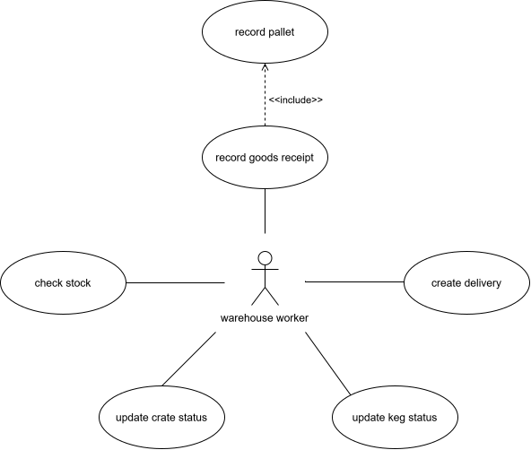

# Beverage Logistics API

**English** | [Deutsch](README.de.md)

A small REST API for managing beverage stock, incoming goods and deliveries
for a brewery (kegs and crates), built as a backend-development portfolio
project.

## Tech stack

- **Python 3.14**
- **FastAPI** — web framework
- **SQLModel** (Pydantic + SQLAlchemy) — data models and ORM
- **SQLite** — single-file database, no separate DB server required
- **Uvicorn** — ASGI server
- **pytest** + FastAPI `TestClient` — automated tests
- **Docker** — containerized deployment

## Architecture

Flat file structure, no `app/` package:

```
beverage-logistics-api/
├── main.py           # FastAPI app, all route definitions
├── models.py         # SQLModel entities, enums, request/response schemas
├── database.py       # engine, session dependency
├── constants.py      # shared constants (date format, error messages)
├── conftest.py       # pytest fixtures (test DB, test client, factories)
├── tests/
│   ├── test_beverages.py
│   ├── test_deliveries.py
│   ├── test_goods_receipts.py
│   ├── test_inventory.py
│   ├── test_packaging_units.py
│   └── test_pallet.py
├── docs/             # ER and use case diagrams
├── requirements.txt       # runtime dependencies
├── requirements-dev.txt   # + test dependencies
├── Dockerfile
└── .dockerignore
```

## Data model



*(Diagram source: [`docs/er-diagram.mmd`](docs/er-diagram.mmd), Mermaid
syntax — edit the source and re-render if the model changes.)*

- **`Beverage`** is an entity (with a `type` field) rather than an enum of
  beer styles. The brewery this project is modeled on actually sells more
  lemonade and water than beer, so "variety" is not a single dimension once
  non-beer beverages are included.
- **`PackagingUnit`** covers both kegs and crates in one table. They are
  told apart solely by the `ContainerType` enum (`keg_20l`, `keg_30l`,
  `keg_50l`, `crate_20x05l`, `crate_24x033l`). Separate `Keg` and `Crate`
  tables were planned initially, but the two ended up with identical
  attributes. Different sizes are enum values rather than tables, since the
  set of real-world container sizes is small and stable.
- **`GoodsReceipt`** and **`Pallet`** model incoming goods. A pallet is
  unpacked into individual packaging units via `POST /pallets/{id}/unpack`.
  `expected_pallet_count` is taken from the delivery slip and is optional;
  the computed `actual_pallet_count` serves as a checksum and may differ.
- **`DeliveryItem`** is the junction table between `Delivery` and
  `PackagingUnit`, so the database itself enforces that a delivery only
  references packaging units that actually exist. Deliveries are historic
  records: a packaging unit cycles through `full` → `empty` → `cleaned` →
  `full` and is reused, so the same unit may appear in several deliveries.
- **`Status`** (`empty`/`cleaned`/`full`) is shared by kegs and crates. This
  is a known simplification: in practice, crates as a whole are rarely
  "cleaned" — individual bottles are rinsed and refilled separately — so
  `cleaned` may end up effectively unused for crates. Acceptable for now
  because nothing in the API enforces state *transitions*; `status` is a
  plain field, not a state machine. Whether a unit is currently part of a
  delivery is not a status either; `DeliveryItem` is the single source of
  truth for that.
- Deliberately **no** dedicated `Stock` table: only current stock matters
  here, not stock over time, so live aggregation — the approach
  `/inventory` uses — stays accurate without introducing a denormalized
  count that could drift out of sync with the actual rows.

Foreign key consistency is enforced by the database (SQLite with
`PRAGMA foreign_keys=ON`); violations are returned as HTTP 409. Business
rules beyond that are deliberately left to the client where possible.

## Use cases



*(Diagram source: [`docs/use-case-diagram.drawio`](docs/use-case-diagram.drawio),
draw.io.)*

The use cases follow the warehouse workflow: goods arrive as a goods receipt
with pallets, pallets are unpacked into individual kegs and crates, their
status is updated as they are emptied and cleaned, stock is checked against a
reserve, and full units leave the warehouse as deliveries. Each use case is
served by the endpoints below.

## Endpoints

| Method | Path | Description |
|--------|------|-------------|
| GET    | `/beverages` | List beverages, optionally filtered by `name`/`beverage_type` |
| POST   | `/beverages` | Create a beverage |
| GET    | `/beverages/{beverage_id}` | Get a single beverage |
| DELETE | `/beverages/{beverage_id}` | Delete a beverage |
| GET    | `/goods-receipts` | List goods receipts, optionally filtered by `receipt_date`/`supplier` |
| POST   | `/goods-receipts` | Create a goods receipt |
| GET    | `/goods-receipts/{goods_receipt_id}` | Get a single goods receipt, including `actual_pallet_count` |
| PATCH  | `/goods-receipts/{goods_receipt_id}` | Update a goods receipt |
| DELETE | `/goods-receipts/{goods_receipt_id}` | Delete a goods receipt |
| GET    | `/pallets` | List pallets, optionally filtered by `best_before`/`beverage_id`/`container_type`/`goods_receipt_id` |
| POST   | `/pallets` | Create a pallet |
| GET    | `/pallets/{pallet_id}` | Get a single pallet |
| PATCH  | `/pallets/{pallet_id}` | Update a pallet |
| DELETE | `/pallets/{pallet_id}` | Delete a pallet |
| POST   | `/pallets/{pallet_id}/unpack` | Create one packaging unit per item on the pallet; re-unpacking recreates them if the pallet data changed |
| GET    | `/packaging-units` | List packaging units, optionally filtered by `beverage_name`/`container_type`/`status` |
| POST   | `/packaging-units` | Create a packaging unit |
| GET    | `/packaging-units/{unit_id}` | Get a single packaging unit |
| PATCH  | `/packaging-units/{unit_id}` | Update a packaging unit's `status` |
| DELETE | `/packaging-units/{unit_id}` | Delete a packaging unit |
| GET    | `/deliveries` | List deliveries, optionally filtered by `delivery_date`/`customer` |
| POST   | `/deliveries` | Create a delivery |
| GET    | `/deliveries/{delivery_id}` | Get a single delivery |
| PATCH  | `/deliveries/{delivery_id}/metadata` | Update delivery `delivery_date` and/or `customer` |
| PATCH  | `/deliveries/{delivery_id}/payload` | Replace a delivery's `unit_ids` |
| DELETE | `/deliveries/{delivery_id}` | Delete a delivery |
| GET    | `/inventory?reserve={n}` | Business-logic endpoint: for each beverage and container type, count packaging units with `status=full` and return only combinations whose count is below `reserve` |

`/inventory` is the endpoint that demonstrates real business logic rather
than plain CRUD: it aggregates and filters on the database side (SQL
`GROUP BY` / `HAVING`) rather than loading all rows and counting in Python.

The interactive docs at `/docs` group the endpoints by these areas and
describe non-obvious behavior and the possible error responses. 409
responses that list packaging unit ids return a structured `detail`
(`{"message": ..., "unit_ids": [...]}`), all other errors a plain string.

## Known limitation

There are no schema migrations yet. Tables are created with SQLModel's
`create_all`, which does not alter existing tables, so after a schema change
the local `beverage_logistics.db` has to be deleted and recreated. A
migration tool (e.g. Alembic) would be part of the PostgreSQL extension
stage (see [Roadmap](#roadmap)).

## Running locally

```powershell
git clone <repo-url>
cd beverage-logistics-api

python -m venv .venv
.\.venv\Scripts\Activate.ps1

pip install -r requirements.txt

uvicorn main:app --reload
```

The API is then available at `http://localhost:8000`, with interactive docs
at `http://localhost:8000/docs`.

SQL statement logging is off by default. To log every SQL statement, set
`SQL_ECHO=true` before starting the app (`$env:SQL_ECHO = "true"` in
PowerShell, or `docker run -e SQL_ECHO=true ...` for the container).

## Running with Docker

```bash
docker build -t beverage-logistics-api .
docker run -p 8000:8000 beverage-logistics-api
```

The container runs as a non-root user and is based on `python:3.14.3-slim`
to keep the image size and vulnerability surface small.

Note: the SQLite database file lives inside the container's filesystem and
is not persisted across container restarts. Adding a volume mount would be
part of the PostgreSQL/docker-compose extension stage (see
[Roadmap](#roadmap)).

## Running tests

```powershell
pip install -r requirements-dev.txt
pytest
```

`requirements-dev.txt` adds the test dependencies (pytest, httpx2 for
FastAPI's `TestClient`, python-dateutil) on top of `requirements.txt`, which
only contains what the app needs at runtime and is all the Docker image
installs.

Tests use an in-memory SQLite database via `dependency_overrides`, so they
never touch the real `beverage_logistics.db`. Test data is created through
the API itself (black-box), using a fixture chain in `conftest.py`
(`beverage` → `goods_receipt` → `pallet` → `unpacked_pallet` → `delivery`)
plus factory fixtures (`make_unit`, `make_pallet`, `make_delivery`).

## Roadmap

These extension stages are deliberately **not** part of the current state —
they are documented here as planning, not as implemented features.

1. **Production-grade database**
   - Switch from SQLite to PostgreSQL
   - Add docker-compose to run the app and database together, with a volume
     for persistence
   - Schema migrations (e.g. Alembic)

2. **More thorough testing**
   - Testcontainers (real PostgreSQL in tests instead of SQLite)
   - Broader coverage of business-logic edge cases

3. **Cloud bridge**
   - CI/CD via GitHub Actions
   - Cloud deployment (e.g. AWS ECS, Fly.io, Render)
   - Infrastructure as Code (Terraform)
   - JWT-based authentication for write endpoints
   - Observability: health endpoint, logging, metrics

## License

[MIT](LICENSE)
